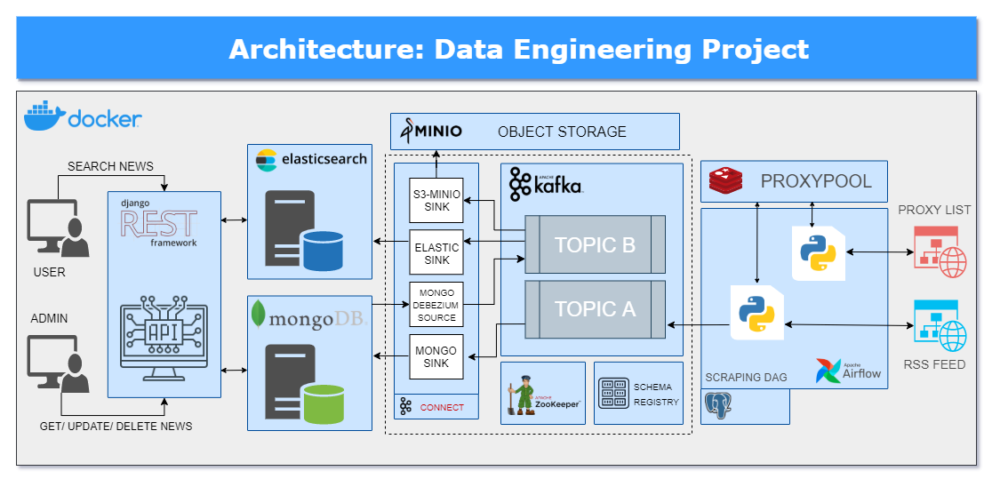

# Data Engineering Project 
  

**Data Engineering Project** is an implementation of the data pipeline which consumes the latest news from RSS Feeds and makes them available for users via handy API.
The pipeline infrastructure is built using popular, open-source projects.

**Access the latest news and headlines in one place.** :muscle:

<!-- TABLE OF CONTENTS -->
## Table of Contents

* [Architecture diagram](#architecture-diagram)
* [How it works](#how-it-works)
    * [Data scraping](#data-scraping)
    * [Data flow](#data-flow)
    * [Data access](#data-access)
* [Prerequisites](#prerequisites)
* [Running project](#running-project)
* [Testing](#testing)
* [API service](#api-service)
* [References](#references)
* [Contributions](#contributions)
* [License](#license)
* [Contact](#contact)

<!-- ARCHITECTURE DIAGRAM -->
## Architecture diagram

<!-- HOW IT WORKS -->
## How it works

#### Data Scraping
Airflow DAG is responsible for the execution of Python scraping modules.
It runs periodically every X minutes producing micro-batches.
- First task updates **proxypool**. Using proxies in combination with rotating user agents can help get scrapers past most of the anti-scraping measures and prevent being detected as a scraper.

- Second task extracts news from RSS feeds provided in the configuration file, validates the quality and sends data into **Kafka topic A**. The extraction process is using validated proxies from **proxypool**.

#### Data flow
- Kafka Connect **Mongo Sink** consumes data from **Kafka topic A** and stores news in MongoDB using upsert functionality based on **_id** field.
- **Debezium MongoDB Source** tracks a MongoDB replica set for document changes in databases and collections, recording those changes as events in **Kafka topic B**.
- Kafka Connect **Elasticsearch Sink** consumes data from **Kafka topic B** and upserts news in Elasticsearch. Data replicated between topics **A** and **B** ensures MongoDB and ElasticSearch synchronization. Command Query Responsibility Segregation (CQRS) pattern allows the use of separate models for updating and reading information.
- Kafka Connect **S3-Minio Sink** consumes records from **Kafka topic B** and stores them in MinIO (high-performance object storage) to ensure data persistency.

#### Data access
- Data gathered by previous steps can be easily accessed in [API service](api)  using public endpoints.

<!-- PREREQUISITES -->
## Prerequisites
Software required to run the project. Install:
- [Docker](https://docs.docker.com/get-docker/) - You must allocate a minimum of 8 GB of Docker memory resource.
- [Python 3.8+ (pip)](https://www.python.org/)
- [docker-compose](https://docs.docker.com/compose/install/)
